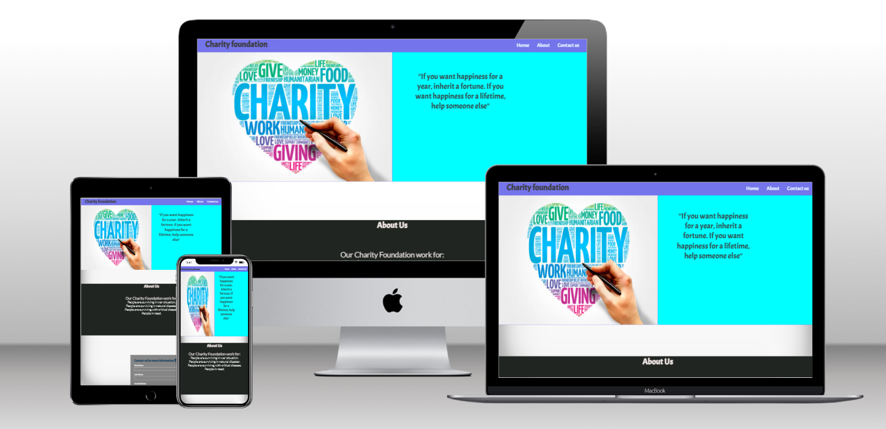
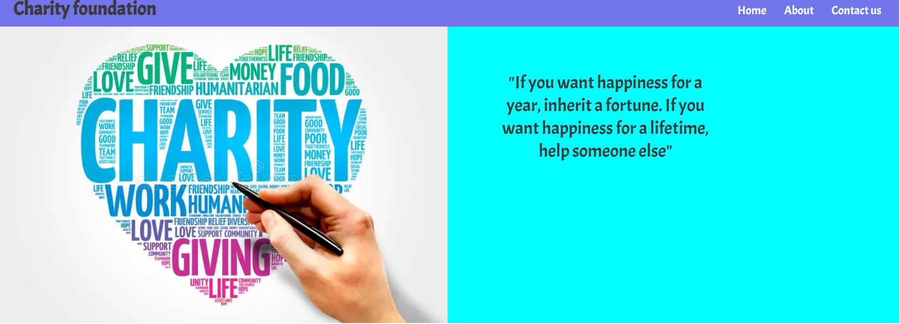
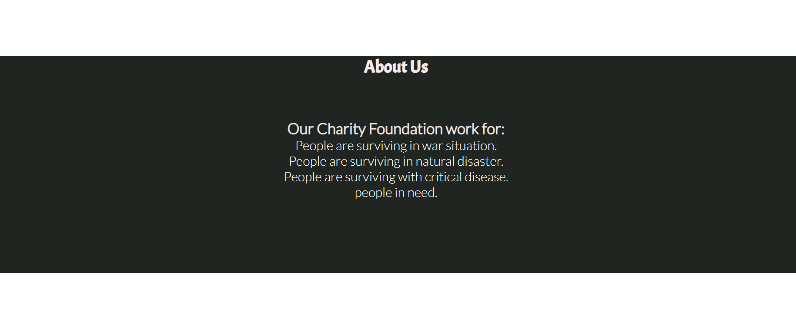
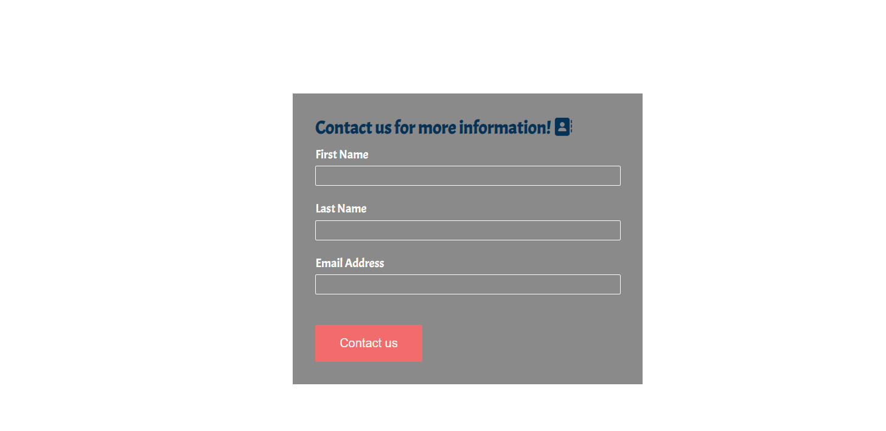
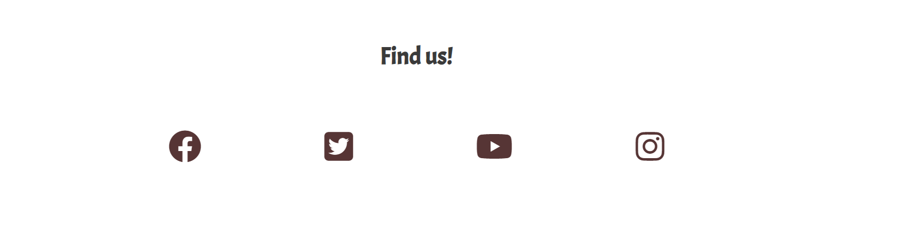
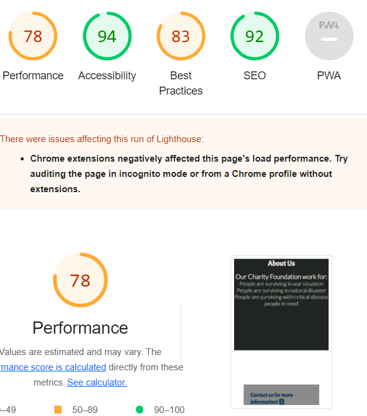

# Portfolio Project1

## First page and viewport for different devices.

### The main structure is based on inspirational espressiones. It is formed by three section; on the top there are three icon bar to navigate each section and scrolling bar to navigate.

## Representation of first section

First section contain;

1. A picture to inspire for donation"

2. A positive quotes.

3. Navigation bar.

## Representation of second section

Second section contain;

1. A brief description about the foundation

## Last section

1. This is a contact page where all of three element required;

## Footer

# Validator Testing

1. HTML
   No errors were returned when passing through the official W3C validator.

2. CSS
   No errors were found when passing through the official (Jigsaw) validator.

3. Accessibility

# deployment

The live link can be found here - 

# content

The content has taken from portafolio project 1 example.

# Media

The picture used on the home page is taken from This Open Source site;

1. I couldn't find all images but first page image website link; (<https://www.google.com/search?q=charity+foundation&tbm=isch&hl=en&chips=q:charity+foundation>,g_1:banner:0OSgopOzdkk%3D,online_chips:charity+poster:jGbU8PH2pfc%3D,online_chips:voluntary+work:Tj_YE9LYT9w%3D,online_chips:illustration:ttp7mrtd4R4%3D&sa=X&ved=2ahUKEwjzj66YreiAAxUO2SoKHZZDDQsQ4lYoBnoECAEQSQ&biw=1519&bih=707)

2. quote has taken from; <https://www.azquotes.com/quote/1339922>
